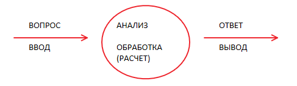
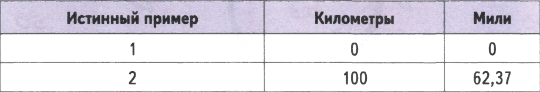

## Структура простой нейросети  

### Прогнозирующая машина (предикатор)
* **Получает вопрос** 
* **Совершает "мыслительный" процесс (вычислительный алгоритм)**
* **Выдает ответ**  

**Допустим есть задача** - преобразовать киллометры в мили а формула нам не известна  
Все что известно это то что данные величины связаны между собой **линейной** зависимостью 

  

Если мы удвоим количество километров то количество миль тоже удвоится  
**МИЛИ = КИЛОМЕТРЫ х К** - (где К - некий коэффициент, константа, неизвестная величина)  

А также известны отдельные примеры правильного выражения расстояния в километрах и милях  

[Алгоритм работы прогнозирующей машины](./search_coeff.xlsx)

